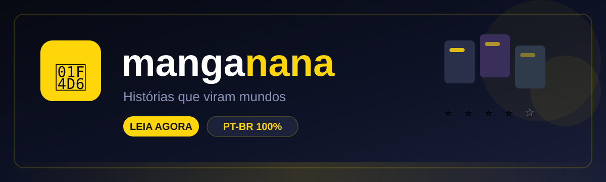

<div align="center">



# 📖 Manganana

**Histórias que viram mundos** — um leitor de mangá em **português brasileiro**, direto no navegador. Sem cadastro, sem download pesado, sem enrolação.

<a href="https://manganana.vercel.app"></a>
<a href="https://vercel.com"></a>
<a href="https://developer.mozilla.org/pt-BR/docs/Web/JavaScript"></a>
<a href="https://www.mangadex.org"></a>
<a href="https://anilist.co"></a>

**⭐ 12.900+ mangás em PT-BR · Leitor completo · PWA instalável · Downloads offline**

</div>

---

## ✨ Funcionalidades

### 🏠 Home turbinada
- **Banner rotativo** com os 5 mais populares (auto-rotação, swipe e indicadores)
- **Continue lendo** — retoma de onde você parou
- **Ranking 🏆** — top 10 com medalhas 🥇🥈🥉
- **"Pra você 🎯"** — recomendações baseadas no seu gosto (favoritos + histórico)
- **5 categorias por gênero** (Ação, Romance, Fantasia, Terror, Comédia) com "Ver tudo" em grade de cards grandes

### 🔍 Busca poderosa
- Pesquisa por título em **12.900+ mangás PT-BR**
- **Filtros avançados**: status (publicando/completo/hiato), ano (2020–2026 ou antes), ordenação (popularidade, recentes, ano, A-Z)
- Chips de gênero + **histórico de buscas recentes**
- Seletor de **27 idiomas** por mangá + provedor alternativo **MangaPill**

### 📖 Leitor completo
- Modo **rolagem vertical** (webtoon) ou **páginas** (horizontal)
- **Fundo** escuro / sépia / claro · **Brilho** 30–130% · **Largura** 50–150%
- **Zoom** por duplo toque · **toque nas bordas** para navegar
- **Modo webtoon contínuo** — rola e carrega o próximo capítulo sozinho
- **Fim de capítulo elegante**: "Próximo capítulo →" · "← Anterior" · "Voltar ao mangá"
- **Ir para página X** · **marcar como lido** · leitura **RTL** (direita → esquerda)
- **Download offline** dos capítulos (PWA)

### 💎 Dados premium (AniList)
- **Nota média com estrelas** estilo streaming, status, capítulos, popularidade, favoritos
- **Personagens principais** com foto e descrição (modal de detalhes)

### 📚 Biblioteca & Perfil
- Favoritos + histórico com **busca interna**, ordenação (Recentes/A-Z/Mais lidos) e **barra de progresso**
- **Alertas de capítulo novo** — toast 🔔 + badge "NOVO" pulsando
- **Capa em destaque** do seu mangá mais lido no perfil
- Estatísticas: favoritos, lidos, páginas

### 📤 Compartilhar
- Botão de compartilhar com **Web Share nativo** (WhatsApp, Telegram…)
- **Link bonito** `?manga=ID` que abre direto a página do mangá

---

## 🚀 Como rodar localmente

```bash
# 1. Clone o repositório
git clone https://github.com/jaivedpereira/Manganana.git
cd Manganana

# 2. Sirva com qualquer servidor estático (ex.: Python)
python3 -m http.server 4173

# 3. Abra no navegador
# http://localhost:4173
```

> O app funciona 100% sem build — é HTML + CSS + JS puro. Os proxies serverless (`/api/*`) só são necessários no deploy (Vercel).

---

## ☁️ Deploy

O app roda na **Vercel** com `vercel.json` forçando estático puro:

```json
{
  "framework": null,
  "buildCommand": "",
  "outputDirectory": ".",
  "cleanUrls": true
}
```

```bash
vercel --prod --yes
```

**Proxies serverless** (usados para burlar CORS/User-Agent):

| Rota | Função |
|------|--------|
| `/api/proxy` | Busca de dados no MangaDex (UA de servidor) |
| `/api/img` | Proxy de imagens (allowlist MangaDex + AniList + Kitsu) |
| `/api/anilist` | Dados premium (nota, personagens, stats) |
| `/api/pill` | Provedor alternativo MangaPill |
| `/api/comick`, `/api/weeb` | Reservados (provedores inviáveis na investigação) |

---

## 🧰 Stack

| Camada | Tecnologia |
|--------|------------|
| Frontend | HTML + CSS + JS puro (zero dependências) |
| Dados | [MangaDex API v5](https://api.mangadex.org) (principal, PT-BR) + [MangaPill](https://mangapill.com) (alternativo) |
| Premium | [AniList GraphQL](https://graphql.anilist.co) (nota, popularidade, personagens) |
| Deploy | [Vercel](https://vercel.com) — estático + serverless functions |
| Offline | Service Worker (PWA) + Cache API |

---

## 📁 Estrutura

```
Manganana/
├── index.html          # UI completa (views, sheets, modais)
├── styles.css          # Tema dark navy + amarelo vibrante
├── app.js              # Toda a lógica do app
├── sw.js               # Service worker (network-first + cache offline)
├── banner.svg          # Banner do README
├── manifest.webmanifest
├── vercel.json
└── api/
    ├── proxy.js        # Proxy MangaDex
    ├── img.js          # Proxy de imagens (allowlist)
    ├── anilist.js      # Dados premium AniList
    ├── pill.js         # Provedor alternativo MangaPill
    ├── comick.js       # (reservado)
    └── weeb.js         # (reservado)
```

---

## 🎨 Tema

| | Cor |
|---|---|
| Fundo | `#070a12` (dark navy) |
| Destaque | `#ffd60a` (amarelo vibrante) |
| Painéis | `#141a2e` / `#1c2239` |
| Texto | `#ffffff` / `#8b93b8` |

Tema claro também disponível nas configurações ☀️

---

## 📜 Changelog

- **v1.4.0** — QoL: biblioteca turbinada (busca/ordenação/progresso), voltar ao topo, fim de capítulo, título dinâmico, compartilhar com link bonito, filtros avançados, capa em destaque, ranking, recomendações, alertas de capítulo novo, cache resolvido (network-first + kill switch)
- **v1.3.0** — QoL: histórico de busca, ir para página, marcar capítulo como lido, textos PT-BR
- **v1.2.0** — Leitor turbinado: fundo/brilho/largura, webtoon contínuo, zoom, tap zones
- **v1.1.0** — Dados premium AniList + personagens + tema claro
- **v1.0.0** — Catálogo MangaDex, leitor, favoritos, downloads offline, PWA

---

<div align="center">

**Feito com 💛 por [jaivedpereira](https://github.com/jaivedpereira)**

*"Histórias que viram mundos"*

</div>
