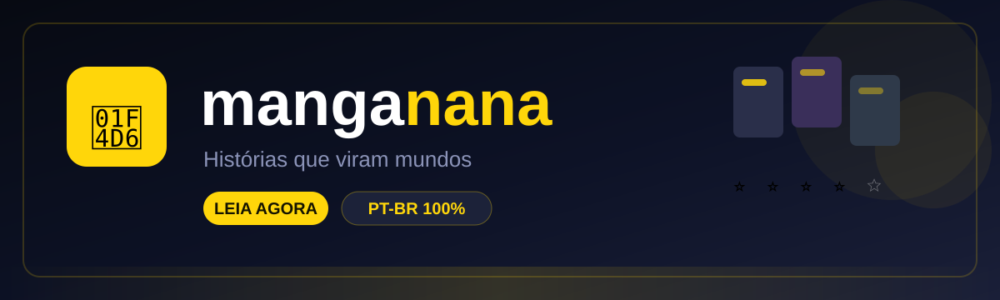

<div align="center">



# 📖 Manganana

**Histórias que viram mundos** — um leitor de mangá em **português brasileiro**, direto no navegador. Catálogo gigante, leitor completo, conta sincronizada e aviso de capítulo novo no Telegram.

<a href="https://manganana.vercel.app"></a>
<a href="https://vercel.com"></a>
<a href="https://developer.mozilla.org/pt-BR/docs/Web/JavaScript"></a>
<a href="https://www.mangadex.org"></a>
<a href="https://anilist.co"></a>

**⭐ 12.900+ mangás em PT-BR · 8 fontes agregadas · Leitor completo · PWA · Conta + sync · Alertas no Telegram**

</div>

---

## ✨ Funcionalidades

### 🏠 Home turbinada
- **Banner rotativo** com os mais populares (auto-rotação, swipe e indicadores)
- **Continue lendo** — retoma de onde parou
- **Ranking 🏆** — top 10 com medalhas 🥇🥈🥉
- **"Pra você 🎯"** — recomendações por conteúdo (favoritos + histórico)
- **5 categorias por gênero** (Ação, Romance, Fantasia, Terror, Comédia) com "Ver tudo"
- **Explorar por fonte** — chips de catálogo completo (Vegitoons, Manga Livre, Madara, Comick)

### 🔍 Busca agregada multi-fonte
Uma única pesquisa consulta **todas as fontes** em paralelo e mostra **badge de origem** em cada card (cor própria por fonte):

| Fonte | Prefixo | Observação |
|-------|---------|------------|
| MangaDex | `md:` | catálogo principal, capítulos pt-br via API v5 |
| Manga Livre | `ml:` | site `.org` exige header `X-ML-Nonce` (bug crítico do Mihon) |
| Vegitoons | `vegi:` | ~4.500 obras com capa |
| Comick | `ck:` | `comick.live` sem Cloudflare — pago via proxy Vercel |
| Madara (Fenix, Ghost, Nebulosa, Geass, Hiper, Tia, Montetai, Nocturne) | `madara:*` | parser único parametrizado por domínio |

Filtros avançados: status (publicando/completo/hiato), ano, ordenação (popularidade, recentes, ano, A-Z), chips de gênero, histórico de buscas e seletor de **27 idiomas** por mangá.

### 📖 Leitor completo
- Modo **rolagem vertical** (webtoon) ou **páginas** (horizontal)
- Webtoon **contínuo** — rola e carrega o próximo capítulo sozinho
- Fundo escuro / sépia / claro · **brilho** 30–130% · **largura** 50–150%
- **Zoom** por duplo toque · **tap zones** nas bordas para navegar
- Leitura **RTL** (direita → esquerda) · ir para página X · marcar como lido
- **Download offline** do capítulo (PWA) · fim de capítulo elegante

### 💎 Dados premium (AniList)
Nota média com estrelas estilo streaming, status, capítulos, popularidade, favoritos e **personagens principais** com foto e descrição (modal de detalhes).

### 👤 Conta, perfil e sync
- Login com **Google via Clerk** — ou continue 100% anônimo, sem cadastro
- **Perfil customizável**: foto, bio, banner de perfil com GIF/imagem, letra de fallback
- **Sincronização via MongoDB** — favoritos, histórico e progresso voltam em qualquer aparelho
- **Comentários** por mangá (com entrou/saiu de Clerk)
- **Botão de sync manual** e indicador de estado

### 🔔 Alertas de capítulo novo no Telegram
Quem vincular o bot recebe **avisos automáticos** de capítulo novo dos mangás que segue (`lendo` / `vou ler`) e **badges de conquista**:

`📖 Primeiras páginas` · `📚 Leitor dedicado` · `🏛️ Biblioteca viva` · `🔥 Viciado oficial` · `👑 Lenda do Manganana` · `🌱 Criando hábito` · `⚡ Semana completa` · `🌋 Mês de fogo` · `🎯 Explorador` · `🧭 Aventureiro` · `🌐 Colecionador de mundos` · `💛 Primeiros favoritos` · `💎 Gosto refinado` · `🏃 Maratonista` · `🦉 Coruja`

### 📚 Biblioteca & compartilhamento
Favoritos + histórico com busca interna, ordenação (Recentes / A-Z / Mais lidos) e barra de progresso. Compartilhamento com **Web Share nativo** e link bonito (`?manga=ID`) que abre direto na página do mangá.

### 🧭 UX
Bottom nav de 3 abas com fundo ativo, perfil no header com avatar redondo, botão voltar ao topo em todas as telas, skeleton no loading, empty-state com card + animação, badge de fonte colorida no detalhe, título dinâmico e **tema claro** configurável ☀️

---

## 🚀 Como rodar localmente

```bash
# 1. Clone
git clone https://github.com/jaivedpereira/Manganana.git
cd Manganana

# 2. Frontend puro (o app funciona sem build — é HTML + CSS + JS)
python3 -m http.server 4173
# abra http://localhost:4173
```

Em `localhost` o app chama a API do MangaDex direto (ele já responde CORS). Fora do localhost, ele passa pelos proxies serverless para evitar bloqueio.

Para rodar o **servidor Node** (perfil, comentários, sync e Clerk juntos):

```bash
npm install
node server.js   # ou: npm run dev  →  http://localhost:3000
```

> ⚠️ Sem as env vars o site ainda funciona como leitor anônimo; só conta/sync/comentários/notificações ficam desligados.

---

## 🔑 Variáveis de ambiente

| Variável | Uso |
|----------|-----|
| `CLERK_PUBLISHABLE_KEY` / `CLERK_SECRET_KEY` | Login social (Google) |
| `MONGODB_URI` | Sync de perfil, favoritos, comentários e lista de notificação |
| `TELEGRAM_BOT_TOKEN` | Envio dos alertas de capítulo novo |
| `NOTIFY_KEY` | Chave interna protegida do endpoint de notificação |
| `CRON_SECRET` | Autenticação dos crons da Vercel |

---

## ☁️ Deploy

```json
{
  "framework": null,
  "buildCommand": "",
  "outputDirectory": ".",
  "cleanUrls": true
}
```

```bash
vercel --prod --yes
```

**Crons configurados** (`vercel.json`):

| Path | Schedule | Função |
|------|----------|--------|
| `/api/notify` | `0 12 * * *` | Varredura diária de capítulos novos → Telegram |
| `/api/notify?mode=monthly` | `0 13 1 * *` | Resumo mensal de conquistas |

**Headers de segurança** aplicados globalmente: `X-Content-Type-Options`, `X-Frame-Options: DENY`, `Referrer-Policy: strict-origin-when-cross-origin` e `Permissions-Policy` (sem câmera/microfone/geolocalização).

---

## 🔌 Endpoints serverless

| Rota | Função |
|------|--------|
| `/api/proxy` | MangaDex com User-Agent de servidor (evita bloqueio) |
| `/api/img` | Proxy de imagens (allowlist de CDNs MangaDex, AniList, Kitsu, Comick, Madara) |
| `/api/anilist` | Dados premium AniList (nota, personagens, stats) |
| `/api/pill` | Provedor alternativo MangaPill |
| `/api/mlivre` | Manga Livre `.org` (nonce + listagem Madara) e Comick |
| `/api/profile` | Perfil, foto e banner (Clerk) |
| `/api/sync` | Sincronização de biblioteca e progresso |
| `/api/comments` | Comentários por mangá |
| `/api/notify` | Alertas de capítulo novo (cron → Telegram) |
| `/api/db`, `/api/cors` | Conexão Mongo e utilitários de CORS |
| `/api/weeb` | Reservado (provedor inviável na investigação) |

---

## 🧰 Stack

| Camada | Tecnologia |
|--------|------------|
| Frontend | HTML + CSS + JS puro (zero dependências, zero build) |
| Dados | [MangaDex API v5](https://api.mangadex.org) + fontes BR (Manga Livre, Vegitoons, Comick, Madara) |
| Premium | [AniList GraphQL](https://graphql.anilist.co) |
| Auth | [Clerk](https://clerk.com) (Google) |
| Banco | [MongoDB](https://mongodb.com) (Atlas) — sync, comentários, notificações |
| Notificações | Telegram Bot API |
| Deploy | [Vercel](https://vercel.com) — estático + serverless + crons |
| Offline | Service Worker (PWA) + Cache API |
| Imagens | `sharp` (thumbnails de perfil) |

---

## 📁 Estrutura

```
Manganana/
├── index.html            # UI completa (views, sheets, modais)
├── styles.css            # Tema dark navy + amarelo vibrante (+ tema claro)
├── app.js                # Toda a lógica do app (~5.400 linhas)
├── sw.js                 # Service worker (network-first + cache offline)
├── server.js             # Servidor Express p/ dev local com Clerk + API
├── scraper_br.py         # Scraper de catálogo Manga Livre (via X-ML-Nonce)
├── banner.svg
├── manifest.webmanifest
├── vercel.json           # Estático + crons + headers de segurança
├── package.json
├── icons/
└── api/
    ├── proxy.js          # Proxy MangaDex
    ├── img.js            # Proxy de imagens (allowlist de CDNs)
    ├── anilist.js        # Dados premium AniList
    ├── pill.js           # MangaPill (alternativo)
    ├── mlivre.js         # Manga Livre + Comick
    ├── profile.js        # Perfil / foto / banner
    ├── sync.js           # Sync de biblioteca
    ├── comments.js       # Comentários
    ├── notify.js         # Alertas Telegram (cron)
    ├── db.js             # Cliente MongoDB
    ├── cors.js           # Utilidades de CORS
    └── weeb.js           # (reservado)
```

---

## 🎨 Tema

| | Cor |
|---|---|
| Fundo | `#070a12` (dark navy) |
| Destaque | `#ffd60a` (amarelo vibrante) |
| Painéis | `#141a2e` / `#1c2239` |
| Texto | `#ffffff` / `#8b93b8` |

Tema claro disponível nas configurações ☀️

---

## 🐛 Armadilhas conhecidas

- **Manga Livre `.org`** — o endpoint de capítulos exige header `X-ML-Nonce`. Sem ele responde **404**. Documentado na extensão oficial do Mihon.
- **MangaDex e capítulos do Comick** vinham com `num` vs `chap` e datas `31/12/1969` — mapeados em `c.num || c.chap` e `timeAgo` ignora data inválida.
- **CORS** — o browser não consegue falar com `api.comick.dev`; tudo passou a ser server-side via `/api/mlivre` com `src=ck`.
- **Imgs lazy** quebram dentro de `overflow:hidden` — usar `loading="eager"`.
- **Cache bust** — bumps de versão (`v20260812xx`) no `sw.js` são obrigatórios a cada deploy, senão o PWA serve a versão antiga.

---

## 📜 Changelog

- **v2.0.0** — Contas Clerk (Google) + perfil customizável, sync MongoDB entre aparelhos, comentários por mangá, alertas de capítulo novo e badges de conquista via Telegram (cron diário + resumo mensal), 8 fontes BR agregadas com badge de origem, Explorar por catálogo completo, skeletons & empty-states, botão voltar ao topo, tema claro
- **v1.4.0** — QoL: biblioteca turbinada (busca/ordenação/progresso), voltar ao topo, fim de capítulo, título dinâmico, compartilhar com link bonito, filtros avançados, capa em destaque, ranking, recomendações, alertas de capítulo novo, cache resolvido
- **v1.3.0** — QoL: histórico de busca, ir para página, marcar capítulo como lido, textos PT-BR
- **v1.2.0** — Leitor turbinado: fundo/brilho/largura, webtoon contínuo, zoom, tap zones
- **v1.1.0** — Dados premium AniList + personagens + tema claro
- **v1.0.0** — Catálogo MangaDex, leitor, favoritos, downloads offline, PWA

---

<div align="center">

**Feito com 💛 por [jaivedpereira](https://github.com/jaivedpereira)**

*"Histórias que viram mundos"*

</div>
